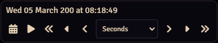
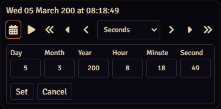
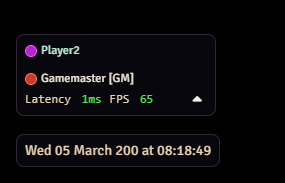

# D.H. / 666f78: Timekeeper

Lightweight timekeeping controls for Foundry Virtual Tabletop. The module exposes the current world time to every player while giving the active GM convenient controls to advance, pause, or fine-tune the clock.

#### GM view



#### Player view


## Features
- Always-visible current world time for every connected user.
- GM toolbar with play/pause, quick step adjustments, and unit selector.
- Inline date/time editor with validation.
- Automatic sync of controls across GMs and players when permissions change.
- Console helpers via globalThis.DHTK for quick debugging.

## Installation
1. Open *Add-on Modules* in Foundry VTT.
2. Choose *Install Module* and paste the manifest URL:
   ```sh
   https://github.com/666f78/dh-timekeeper/releases/latest/download/module.json
   ```
3. Install, enable the module in your world, and reload the client.

Alternatively, download the latest release archive from the [GitHub releases](https://github.com/666f78/dh-timekeeper/releases) page and drop the dist/ contents into your Foundry Data/modules directory.

## Usage
- The current world time renders in the player list panel.
- Active GMs see the toolbar:
  - **Calendar**: open the inline editor to set an exact date/time.
  - **Play/Pause**: start or stop automatic ticking (one-second increments when the tab is visible and the game is unpaused).
  - **Arrows**: advance or rewind the clock by the selected unit.
  - **Unit select**: choose the step size (seconds, minutes, hours, days, months, years).
- All changes broadcast automatically to connected clients.

## Contributing
Feedback and pull requests are welcome. Please use GitHub Issues for bug reports or feature requests.

## License
Distributed under the MIT License. See [LICENSE](LICENSE) for details.
